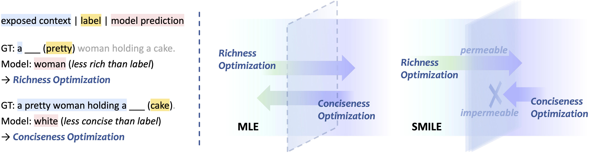
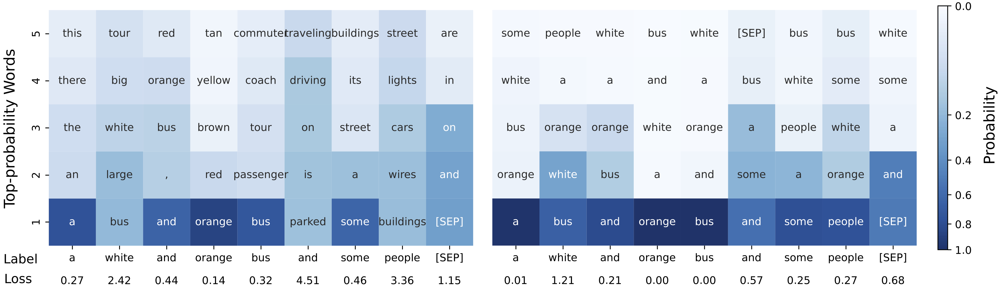

<div>
  <h2 align="center">
    🫠 SMILE
  </h2>
</div>

<p align="center">
    <a >
       
  	</a>
    <a >
       
  	</a>
    <a >
       
  	</a>
    <br />
</p>

Demonstrative PyTorch code for our paper [Learning Descriptive Image Captioning via Semipermeable Maximum Likelihood Estimation](https://arxiv.org/abs/2306.13460).

---

## Introduction

Image captioning aims to describe visual content in natural language. As ‘a picture is worth a thousand words’, there could be various correct descriptions for an image. However, with maximum likelihood estimation as the training objective, the captioning model is penalized whenever its prediction mismatches with the label. For instance, when the model predicts a word expressing richer semantics than the label, it will be penalized and optimized to prefer more concise expressions, referred to as *conciseness optimization*. In contrast, predictions that are more concise than labels lead to *richness optimization*. Such conflicting optimization directions could eventually result in the model generating general descriptions. In this work, we introduce **S**emipermeable **M**ax**I**mum **L**ikelihood **E**stimation (SMILE), which allows richness optimization while blocking conciseness optimization, thus encouraging the model to generate longer captions with more details. Extensive experiments on two mainstream image captioning datasets MSCOCO and Flickr30K demonstrate that SMILE significantly enhances the descriptiveness of generated captions. We further provide in-depth investigations to facilitate a better understanding of how SMILE works.


> Descriptive captions generated by our SMILE-optimized captioning model, compared to human annotations and descriptions generated by the MLE-optimized captioning model.


> **Left:** Examples of richness optimization and conciseness optimization. When the label is "pretty" while the model predicts "woman", which forms less rich semantics, it leads to richness optimization; when the label is "cake" while the model predicts "white", conciseness optimization occurs.  
> **Right:** SMILE presents a ‘semi-permeability’ that accepts richness optimization while blocking conciseness optimization. 


> Token-level model predictive distribution and penalization of (left) MLE and (right) SMILE. The model is less penalized if the label word is assigned a higher probability.

# Code

The implementation of our method is super simple. Just replace the code for loss calculation in the `forward()` function in your codebase with our code provided below. We provide a pseudocode in a PyTorch-like style for better understanding, as well as two demonstrative codes implemented for [BLIP](https://github.com/salesforce/BLIP) and text generation models in [HuggingFace transformers](https://github.com/huggingface/transformers), respectively.

## Pseudocode

```python
# B: batch size
# N: sequence length
# V: vocabulary size
# logits: language model prediction logits (B x N x V)
# labels: ground truth label at each position (B x N)

if objective == 'MLE':
    loss = CrossEntropyLoss(logits, labels)

elif objective == 'SMILE':
    # each sequence gets a unique mask to mask words not in the sequence
    logits_mask = zeros(B, V).scatter_(1, labels, True) # B x V

    # expand for every position in the sequence
    logits_mask = logits_mask.unsqueeze(1).expand(-1, N, -1).clone() # B x N x V

    # perform first-token MLE (optional)
    logits_mask[:, 0, :] = True # B x N x V

    # apply mask to the logits
    selected_logits = logits.masked_fill(logits_mask==False, float('-inf')) # B x N x V
    
    loss = CrossEntropyLoss(selected_logits, labels)
```

## BLIP

Original code:


```python
decoder_output = self.text_decoder(text.input_ids, 
                                      attention_mask = text.attention_mask, 
                                      encoder_hidden_states = image_embeds,
                                      encoder_attention_mask = image_atts,                  
                                      labels = decoder_targets,
                                      return_dict = True,   
                                  )
loss_lm = decoder_output.loss
```

SMILE code:

```python
decoder_output = self.text_decoder(text.input_ids, 
                                      attention_mask = text.attention_mask, 
                                      encoder_hidden_states = image_embeds,
                                      encoder_attention_mask = image_atts,                  
                                      labels = decoder_targets,
                                      return_dict = True,   
                                  )
logits = decoder_output.logits[:, self.prompt_length-1:-1]

label = text.input_ids[:, self.prompt_length:].contiguous()
N = label.size(1)
bs = text.input_ids.size(0)
vs = self.text_decoder.config.vocab_size

# SMILE
logits_mask = torch.zeros(bs, vs).to(logits.device).scatter_(1, label, True)
logits_mask[:, 0] = 0 # first-token MLE
logits_mask = logits_mask.unsqueeze(1).expand(-1, N, -1).clone()
selected_logits = logits.masked_fill(logits_mask == 0, float('-inf'))
loss = F.cross_entropy(selected_logits.view(-1, vs), label.view(-1), ignore_index=0, reduction='mean')
```

We also provide the implementation of *Random subsetting* and *Reverse subsetting* mentioned in our paper:

```python
# Random subsetting
sample_num = 10
rand_indices = torch.randint(vs, (bs, N, sample_num)).to(label.device)
rand_indices_with_label = torch.cat((rand_indices, label.unsqueeze(2)), dim=2) # (bs, N, sample_num + 1)
batch_indices = torch.arange(bs)[:, None, None].expand(bs, N, sample_num + 1)
seq_indices = torch.arange(N)[None, :, None].expand(bs, N, sample_num + 1)
random_mask = torch.zeros(bs, N, vs).to(label.device)
random_mask[batch_indices, seq_indices, rand_indices_with_label] = 1
random_mask[:, :, 0] = 0
selected_logits = logits.masked_fill(random_mask == 0, float('-inf'))
loss = F.cross_entropy(selected_logits.view(-1, vs), label.view(-1), ignore_index=0, reduction='mean')
  
# Reverse subsetting
reverse_mask = torch.ones(bs, vs).to(logits.device).scatter_(1, label, False)
reverse_mask = reverse_mask.unsqueeze(1).expand(-1, N, -1).clone()
reverse_mask.scatter_(2, label.unsqueeze(-1), 1)
selected_logits = logits.masked_fill(reverse_mask == 0, float('-inf'))
loss = F.cross_entropy(selected_logits.view(-1, vs), label.view(-1), ignore_index=0, reduction='mean')
```

## HuggingFace transformers models

We take `transformers/models/t5/modeling_t5.py` as an example:

Original code:

```python
lm_logits = self.lm_head(sequence_output)

loss = None
if labels is not None:
    loss_fct = CrossEntropyLoss(ignore_index=-100)
    loss = loss_fct(lm_logits.view(-1, lm_logits.size(-1)), labels.view(-1))
```

SMILE code:

```python
lm_logits = self.lm_head(sequence_output)

loss = None
if labels is not None:

    N = decoder_input_ids.size(1)
    bs = decoder_input_ids.size(0)
    vs = lm_logits.size(-1)
    labels_ = labels.clone()
    labels_[labels_ == -100] = 0
    
    logits_mask = torch.zeros(bs, vs).to(decoder_input_ids.device).scatter_(1, labels_, True)
    logits_mask[:, 0] = 0
    logits_mask = logits_mask.unsqueeze(1).expand(-1, N, -1).clone()
    logits_mask[:, 0, :] = 1
    selected_logits = lm_logits.masked_fill(logits_mask == 0, float('-inf'))
    loss_fct = CrossEntropyLoss(ignore_index=-100)
    loss = loss_fct(selected_logits.view(-1, selected_logits.size(-1)), labels.view(-1))
```

# Citation

If you find this repo to be helpful for your research, please consider citing our paper:

```bibtex
@misc{yue2023learning,
      title={Learning Descriptive Image Captioning via Semipermeable Maximum Likelihood Estimation}, 
      author={Zihao Yue and Anwen Hu and Liang Zhang and Qin Jin},
      year={2023},
      eprint={2306.13460},
      archivePrefix={arXiv},
      primaryClass={cs.CL}
}
```

# Acknowledgement

Our work relies on resources from [BLIP](https://github.com/salesforce/BLIP) and [HuggingFace transformers](https://github.com/huggingface/transformers). Many thanks to them for their amazing efforts.