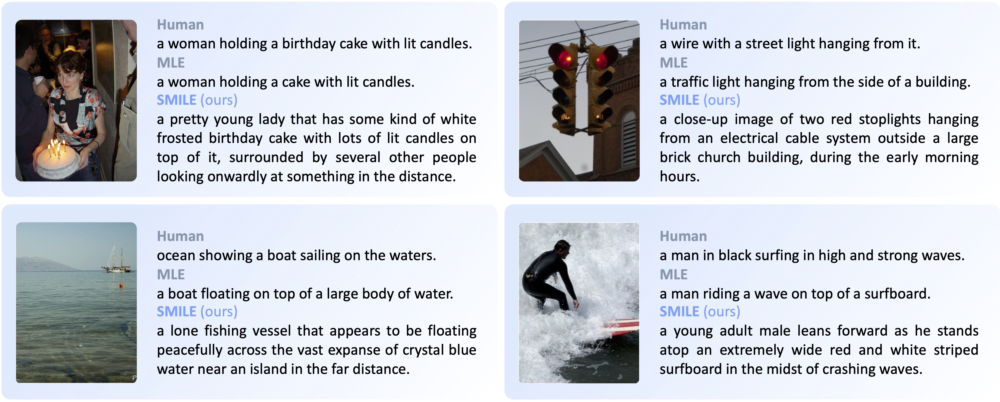

<div>
  <h2 align="center">
    🤗 SMILE
  </h2>
</div>

<p align="center">
    <a >
       
  	</a>
    <a >
       
  	</a>
    <a >
       
  	</a>
    <a >
      
  	</a>
    <a >
  
  	</a>
    <br />
</p>


[Learning Descriptive Image Captioning via Semipermeable Maximum Likelihood Estimation](https://arxiv.org/abs/2306.13460)



---

## News 📢

- [2023.09.30] We now provide the code and our trained checkpoints (of BLIP) for quick deploying and easy reproduction. The previous demonstrative codes are now available at [demonstrative.md](./assets/demonstrative.md).
- [2023.06.26] We provide the demonstrative codes to show how to implement SMILE in your codebase, including a pseudocode, a [BLIP](https://github.com/salesforce/BLIP) version, and a [transformers](https://github.com/huggingface/transformers) version.

## Demo

Try out our [online demo](https://huggingface.co/spaces/yuezih/BLIP-SMILE) integrated into Huggingface Spaces 🤗 using Gradio!

## Usage

```
git clone https://github.com/yuezih/SMILE
cd SMILE/BLIP
```

### Installation

```
pip install -r requirements.txt
```

The code has been tested on PyTorch 2.0.0.

### Data Preparation

The data configs are in `SMILE/BLIP/configs/caption_coco.yaml`.
- Set the `image_root` to your MSCOCO image root.
- MSCOCO annotation files will be automatically downloaded.

### Checkpoints

The pre-trained and MLE-finetuned checkpoints are available at the [original BLIP repo](https://github.com/salesforce/BLIP).

We provide our two checkpoints finetuned on MSCOCO with SMILE:
- `blip_smile_base.pth`: The vanilla SMILE-optimized BLIP.
- `blip_mle_smile_base.pth`: BLIP finetuned with MLE+SMILE (0.01:0.99), with a compromise between descriptiveness and accuracy.

Model|Cap. Len.|Lex. Div.|R@1|R@5|CLIPScore|PPL
-|:-:|:-:|:-:|:-:|:-:|:-:
`blip_smile_base.pth`|22.3|4.5|10.0|24.5|75.0|95.6
`blip_mle_smile_base.pth`|19.8|3.6|**10.9**|**25.1**|76.2|79.4

They are available at our [Huggingface Spaces](https://huggingface.co/spaces/yuezih/BLIP-SMILE/tree/main/model). You can clone the entire space with the following commands, and then the checkpoints can be found in `BLIP-SMILE/model`.

```
# Make sure you have git-lfs installed (https://git-lfs.com)
git lfs install
git clone https://huggingface.co/spaces/yuezih/BLIP-SMILE
```

We also provide the [link](https://1drv.ms/f/s!AocXJ7uKxt6XccRUrspMf11CHgw?e=GLrM1O) to download the checkpoints from OneDrive.


After preparing the checkpoint, Set the checkpoint path in `SMILE/BLIP/configs/caption_coco.yaml`.

### Training & Inference

```
bash scripts/train.sh
```

```
bash scripts/eval.sh
```

Kind reminders:
- Please use `transformers==4.15.0` rather than a higher version.
- For `torch<2.0.0`, replace `torchrun` with `python -m torch.distributed.run` in the training and inference scripts.

## Citation

If you find this repo to be helpful for your research, please consider citing our paper:

```bibtex
@misc{yue2023learning,
      title={Learning Descriptive Image Captioning via Semipermeable Maximum Likelihood Estimation}, 
      author={Zihao Yue and Anwen Hu and Liang Zhang and Qin Jin},
      year={2023},
      eprint={2306.13460},
      archivePrefix={arXiv},
      primaryClass={cs.CL}
}
```

## Acknowledgement

Our work relies on resources from [BLIP](https://github.com/salesforce/BLIP) and [HuggingFace transformers](https://github.com/huggingface/transformers). Many thanks to them for their amazing efforts.
